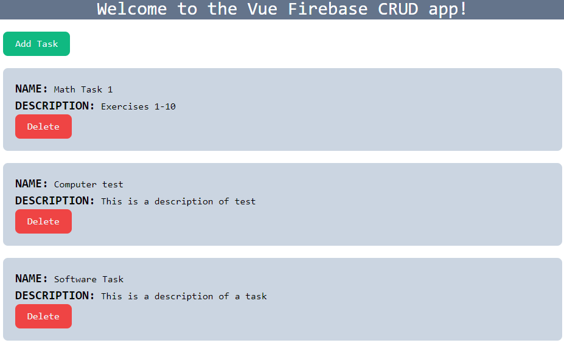

# VUE & FIREBASE - CRUD

Este proyecto fue creado siguiendo el tutorial del canal "Noob dev tutorials" en YouTube. El video original que sirvió de inspiración se encuentra en [este enlace](https://www.youtube.com/watch?v=72uJ04OBojc). Agradecemos al creador del video por proporcionar un recurso valioso para aprender a desarrollar aplicaciones Vue.js con Firebase.

## Descripción del Proyecto

Este proyecto es una aplicación CRUD (Crear, Leer, Actualizar, Eliminar) desarrollada en Vue.js y utiliza Firebase como backend para almacenar y gestionar tareas. Permite a los usuarios realizar operaciones básicas en una lista de tareas, como agregar nuevas tareas, editarlas y eliminarlas. Además, se utilizó Tailwind CSS para los estilos.

## Cómo Probar el Proyecto

Siga estos pasos para probar el proyecto en su entorno local:

1. Clona el repositorio desde GitHub:

   ```bash
   git clone https://github.com/RickC1218/CRUD-Vue-Firebase-Tasks.git
   ```

2. Navega al directorio del proyecto:

   ```bash
   cd CRUD-Vue-Firebase-Tasks
   ```

3. Instala las dependencias del proyecto:

   ```bash
   npm install
   ```

4. Configura Firebase:
   
   - Crea un proyecto en Firebase en [Firebase Console](https://console.firebase.google.com/).
   - Configura la base de datos en Firebase y asegúrate de tener las credenciales adecuadas.
   - Copia la configuración de Firebase en un archivo `.env` en la raíz del proyecto siguiendo el ejemplo en `.env.example`. Asegúrate de completar los valores de `VUE_APP_API_KEY`, `VUE_APP_AUTH_DOMAIN`, `VUE_APP_PROJECT_ID`, `VUE_APP_STORAGE_BUCKET`, `VUE_APP_MESSAGING_SENDER_ID`, y `VUE_APP_APP_ID` con tus propias credenciales.

5. Inicia la aplicación:

   ```bash
   npm run dev
   ```

6. Abre tu navegador y visita `http://localhost:8080` para ver la aplicación en funcionamiento.

7. ¡Disfruta de la aplicación y comienza a gestionar tus tareas!

## Créditos

- Este proyecto se basa en el tutorial de "Noob dev tutorials". Puedes encontrar más contenido en su [canal de YouTube](https://www.youtube.com/@noobdevtutorials50).

## Imagen de la Aplicación
